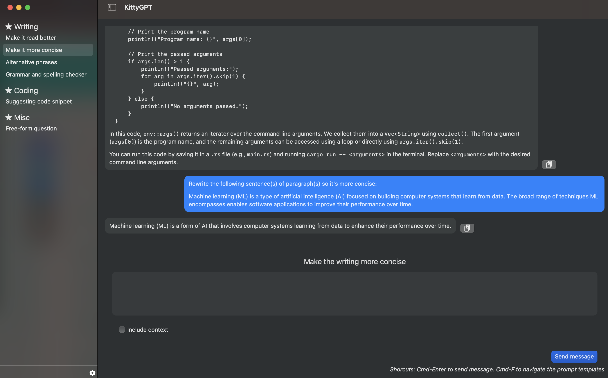

## KittyGPT

A simple macOS client for OpenAI and Claude models. Supported models include:
* `text-davinci-003` model of the OpenAI API, the same engine that powers ChatGPT. 
* Claude (instant and v2) via AWS Bedrock.

To use this application, you will need either:
* An API key from OpenAI. If you don't have one, you can generate an API key by visiting 
the [OpenAI API Keys](https://platform.openai.com/account/api-keys) page.
* AWS credentials of an IAM user or session that has `bedrock-runtime:InvokeModel` permission. See 
AWS docs for the steps to [create IAM user access key](https://docs.aws.amazon.com/IAM/latest/UserGuide/id_credentials_access-keys.html#Using_CreateAccessKey)
or [how to configure credentials file](https://docs.aws.amazon.com/cli/latest/userguide/cli-configure-files.html).

Please note that while this application is open-source and free to use, the usage of the OpenAI API and AWS are not free. Ensure 
you are aware of the associated costs before using the application extensively.

## Key Features

* Prompt templates: you can create templates for prompts, allowing you to quickly generate structured input for the 
  API calls.

## Credits

This project makes use of the following resources:

* OpenAI API - The `text-davinci-003` engine is powered by the OpenAI API. Visit OpenAI for more information.
* [AWS Bedrock](https://aws.amazon.com/bedrock/) 
* icon.kitchen - The app icon was generated using resources from [icon.kitchen](https://icon.kitchen/)

## License

This project is licensed under the MIT License. Feel free to use, modify, and distribute the code according to the terms of the license.

## Disclaimer

The models and APIs used by this application are developed and maintained by OpenAI, Anthropic, and AWS. This application is merely 
a wrapper that utilizes those engine's capabilities. For any issues related to the language model or its usage, please refer to the 
respective service's documentation and support channels.
